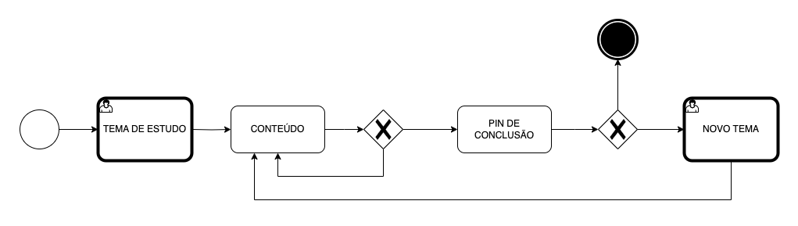
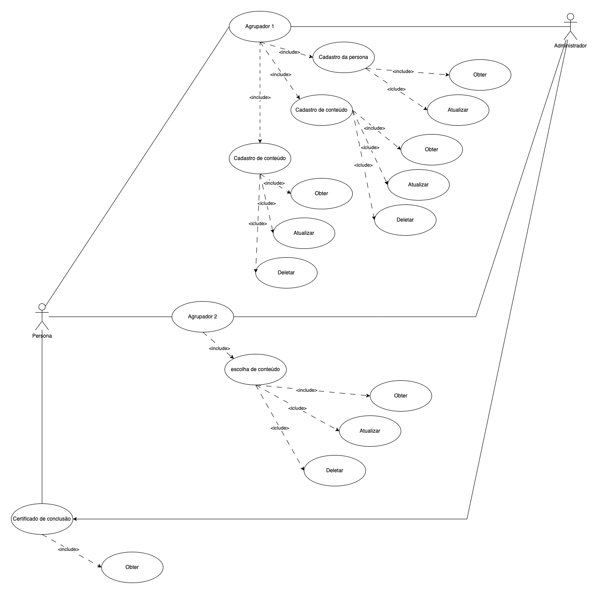
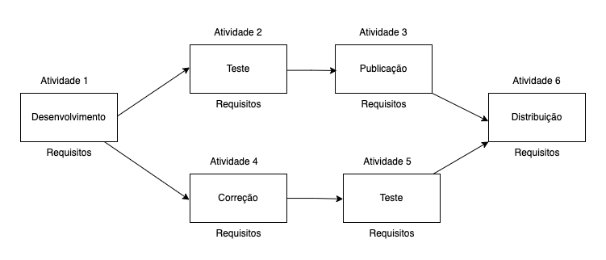

# Especificações do Projeto

Pré-requisitos: <a href="https://github.com/ICEI-PUC-Minas-PMV-ADS/pmv-ads-2024-1-e3-proj-mov-t4-game-of-ti/blob/main/docs/01-Documentação%20de%20Contexto.md"> Documentação de Contexto</a>

Dado problema das personas têm dificuldade de compreensão da área de TI (tecnologia da informação) a ideia é buscar a solução a partir da perspectiva das personas entrevistadas.

Tabelas de conteúdo 
1. [Personas](#personas)
2. [Histórias de Usuários](#histórias-de-usuários)
3. [Modelagem do Processo de Negócio](#modelagem-do-processo-de-negócio)
4. [Indicadores de Desempenho](#indicadores-de-desempenho)
5. [Requisitos](#requisitos)
6. [Requisitos Funcionais](#requisitos-funcionais)
7. [Requisitos não Funcionais](#requisitos-não-funcionais)
8. [Restrições](#restrições)
9. [Diagrama de Casos de Uso](#diagrama-de-casos-de-uso)
10. [Matriz de Rastreabilidade](#matriz-de-rastreabilidade)

## Personas

### As personas levantadas durante o processo de entendimento do problema são apresentadas abaixo. 

**Obs:** *Personas essas que tem a necessidade de entendimento e o real interesse pela carreira do profissional de TI (tecnologia da informação), mas devido a complexidade de cada área e as nomenclaturas não conseguem buscar um trilha de capacitação conforme sua afinidade.*

O **primeiro caso** é do Renato Machado, trabalhador autônomo que aos seus 43 anos de vida, busca se qualificar para atuar como gestor de TI (tecnologia da informação). Sua história traz na fala a dificuldade de entendimento das nomenclaturas adotadas pelo mercado, tendo como sua maior dificuldade o entendimento de termos em inglês.

O **segundo caso** é da Cecília Fernandez, desempregada e formada em gastronomia que aos seus 35 anos de vida, busca se qualificar para atuar como gestor de TI (tecnologia da informação). Sua história traz na fala a dificuldade de entendimento das possibilidades de atuação no mercado, tendo como seu maior diferencial o inglês e a criação de pratos visando a melhor experiência para o cliente.

O **terceiro caso** é do Givanildo de Souza, estudante do primeiro semestre de TI que aos seus 20 anos de vida, busca atuar com TI (tecnologia da informação). Sua história traz na fala a dificuldade de entendimento das possibilidades de atuação no mercado, sem experiência mas com algumas passagens por outras áreas do mercado de trabalho.

O **quarto caso** é da Sara Bianchi, estudante do último semestre de TI 30 anos de vida, busca se qualificar para atuar como programadora de TI (tecnologia da informação). Sua história traz na fala a dificuldade de entendimento das possibilidades de atuação como programadora no mercado, sem experiência e dificuldades de saber quais cursos e aperfeiçoamentos deve obter.

O **quinto caso** é do Pedro Moraes, empregado e formado em TI aos seus 25 anos de vida, busca se qualificar para atuar com DevOps de TI (tecnologia da informação). Sua história traz na fala a dificuldade de entendimento das possibilidades de atuação com cloud no mercado, tendo como seu maior diferencial o inglês e a vivência em empresas que usam sistemas on-premises.

## Histórias de Usuários

Com base na análise das personas forma identificadas as seguintes histórias de usuários:

### Usuário do sistema

| EU COMO... `PERSONA` | QUERO/PRECISO ... `FUNCIONALIDADE` | PARA ... `MOTIVO/VALOR` |
|--|--|--|
| Usuário do sistema | Registrar ou trocar e deletar meus interesses | Manter o foco na jornada |
| Usuário do sistema | Buscar por conteúdos relacionados aos meus interesses | Manter o foco na jornada |
| Usuário do sistema | Entender sobre o tema relacionados aos meus interesses | Qualificar conforme a jornada |
| Usuário do sistema | Entender sobre as possibilidades de atuação relacionados aos meus interesses | Qualificar conforme a jornada |
| Usuário do sistema | Obter formas de demonstrar o conhecimento obtidos conforme os meus interesses | Qualificar conforme a jornada |
| Usuário do sistema | Cadastrar e editar um perfil profissional | Buscar uma colocação no mercado|

### Administrador do sistema

| EU COMO... `PERSONA` | QUERO/PRECISO ... `FUNCIONALIDADE` | PARA ... `MOTIVO/VALOR` |
|--|--|--|
| Administrador | Alterar permissões | Permitir que possam administrar contas |
| Administrador | Cadastrar conteúdo | Permitir que possam administrar o sistema |
| Administrador | Editar conteúdo | Permitir que possam administrar o sistema |

As histórias de usuário listadas acima, são relevantes para o projeto de sua solução. 

Conforme as Histórias de Usuário, sendo admistrador ou não, consistem em uma ferramenta poderosa para a compreensão e elicitação dos requisitos funcionais e não funcionais da sua aplicação listados abaixo neste documento.

## Modelagem do Processo de Negócio 

### Análise da Situação Atual

Dado o crescimento tecnológico as empresas buscam cada vez mais profissionais formados e qualificados para atuar nas área de TI(Tecnologia da informação), como postando no site Olhar Digital[^1], o Brasil em 2024 deve superar o EUA no crescimento e na busca.

Visando o cenário descrito acima, a proposta trás como forma inovadora o aprendizado sobre quais são as oportunidades existentes no mercado de TI (Tecnologia da informação), explorando conceitos e simplificando de forma que as persona possam usufruir de forma a se capacitarem em níveis básico sobre o tema.

### Descrição Geral da Proposta

Através de um aplicativo mobile as persona acessam uma plataforma com temas de jornadas que exploram os conceitos TI (Tecnologia da informação), DEVOPS, Programação, Tester, Gestão e etc.

Conforme a persona vai interagindo com a aplicação ele vai concluindo temas, subindo de nível e ganhando uma pontuação de dará acesso aos outros conteúdos disponíveis.

### Processo 1 – PROCESSO ESCOLHA DO TEMA DE ESTUDOS

Oportunidades de melhorias para o processo 1. 

A cada conclusão do tema inicial a persona poderá iniciar um novo tema.

### Processo 2 – PROCESSO NIVEIS DO TEMA DE ESTUDOS

Oportunidades de melhorias para o processo 2. 

A cada conclusão do tema inicial a persona poderá iniciar em um novo nível de aprofundamento de estudos.

## Indicadores de Desempenho

Apresente aqui os principais indicadores de desempenho e algumas metas para o processo. Atenção: as informações necessárias para gerar os indicadores devem estar contempladas no diagrama de classe. Colocar no mínimo 5 indicadores. 

| Indicador | Objetivo | Descrição | Cálculo | Fonte dados | Perspectiva |  
|--|--|--|--|--|--|
| Percentual de erros | Metrificar a quatidade de erros reportados | A cada tentantiva de acesso ao sistema ou conteúdo contabilizar |  1*1 | Tabela de log de erros | Melhoria de funcionalidades |
| Aderencia de conteúdo | Metrificar a qualidade do conteúdo | Através de feedback das persona metrificar em % a qualidade do conteúdo | *100 | Tabela de log avaliação do tema | Melhoria de conteúdo |
| Conclusão do tema | Metrificar a quantidade de conclusão |  Metrificar em % a quantidade de conteúdo concluído pelas persona | *100 | Tabela de log avaliação do tema | Melhoria de conteúdo |
| Persona ativa | Metrificar a quantidade de persona ativas |  Metrificar em % a quantidade de persona ativas | *100 | Tabela de log avaliação do tema | Melhoria de conteúdo |
| Quantidade de download | Metrificar a quantidade de download | Metrificar em % a qualidade de downloads | *100 | Tabela de log avaliação da aplicação | Melhoria da aplicação |

## Requisitos

As tabelas que se seguem apresentam os requisitos funcionais e não funcionais que detalham o escopo do projeto. Para determinar a prioridade de requisitos, aplicar uma técnica de priorização de requisitos e detalhar como a técnica foi aplicada.

### Requisitos Funcionais
[Requisitos Funcionais
 (RF)](https://pt.wikipedia.org/wiki/Requisito_funcional):
 correspondem a uma funcionalidade que deve estar presente na
  plataforma (ex: cadastro de usuário).

| ID | Descrição do Requisito | Prioridade |
|--|--|--|
| RF-001 | Permitir que o usuário cadastre no sistema | ALTA |  |
| RF-002 | Permitir que o usuário cadastre seu perfil profissional no sistema | ALTA |  |
| RF-003 | Permitir que o usuário edite seu cadastro no sistema | MÉDIA |  |
| RF-004 | Permitir que o usuário cadastre interesses | ALTA |  |
| RF-005 | Permitir que o usuário edite seu cadastro de interesses | MÉDIA |  |
| RF-006 | Permitir que o usuário delete seu cadastro de interesses | MÉDIA |  |
| RF-007 | Permitir que o usuário interaja no sistema conforme cadastro de interesses | MÉDIA |  |
| RF-008 | Permitir que o usuário busque no sistema informações conforme cadastro de interesses | MÉDIA |  |
| RF-009 | Permitir que o usuário delete no sistema conforme cadastro de interesses | MÉDIA |  |
| RF-010 | Permitir que o usuário administrador cadastre conteúdos novos no sistema | ALTA |  |
| RF-011 | Permitir que o usuário administrador edite conteúdos no sistema | MÉDIA |  |
| RF-012 | Permitir que o usuário administrador edite o nível de permissão do usuário no sistema | MÉDIA |  |
| RF-013 | Emitir um relatório de tarefas no mês | BAIXA |
| RF-014 | Emitir um certificado de qualificação sobre o conteúdo concluído | BAIXA |

### Requisitos não Funcionais
[Requisitos Não Funcionais
  (RNF)](https://pt.wikipedia.org/wiki/Requisito_n%C3%A3o_funcional):
  correspondem a uma característica técnica, seja de usabilidade,
  desempenho, confiabilidade, segurança ou outro (ex: suporte a
  dispositivos iOS e Android).

| ID | Descrição do Requisito | Prioridade |
|--|--|--|
| RNF-001 | O sistema deve rodar em um dispositivos móvel | MÉDIA |  |
| RNF-002 | Deve processar requisições do usuário em no máximo 3s | BAIXA |  |
| RNF-003 | Deve processar manter salvo o coteúdo de interesse do usuário | ALTA |  |
| RNF-004 | Deve processar novos coteúdo publicados por parte do usuário administrador | MÉDIA |  |
| RNF-005 | Deve processar como concluido coteúdo finalizado pelo usuário | MÉDIA |  |
| RNF-006 | Deve processar um certificado de conclusão de coteúdo após finalizado pelo usuário | MÉDIA |  |

## Restrições

O projeto está restrito pelos itens apresentados na tabela a seguir.

| ID | Restrição |
|--|--|
| 01 | O projeto deverá ser entregue até o final do semestre |
| 02 | O projeto deverá ser desenvolvido um módulo de backend para administrar conteúdo |
| 03 | O projeto deverá ser desenvolvido um módulo de aplicação movél |
| 04 | O projeto deverá conter usando a tecnica de gamificação (ou gamification, em inglês) |
| 05 | O projeto deverá explor os pilares de autonomia, propósito e maestria de gamificação (ou gamification, em inglês) |

## Diagrama de Casos de Uso

# Matriz de Rastreabilidade

Dados os requisitos funcionais e não funcionas a matriz de rastreabilidade será uma ferramenta usada para facilitar a visualização dos relacionamento entre requisitos e outros artefatos ou objetos, permitindo a rastreabilidade entre os requisitos e os objetivos de negócio. 

|  | USER | ADM | RF-001 | RF-002 | RF-003 | RF-004 | RF-005 | RF-006 | RF-007 | RF-008 | RF-009 | RF-010 | RF-011 | RF-012 | RF-013 | RF-014 | RNF-001 | RNF-002 | RNF-003 | RNF-004 | RNF-005 | RNF-006 | TC-001 | DC-001 |
|--|--|--|--|--|--|--|--|--|--|--|--|--|--|--|--|--|--|--|--|--|--|--|--|--|
| USER |  |  |  |
| ADM |  |  |  |
| RF-001 |  |  |  |
| RF-002 |  |  |  |
| RF-003 |  |  |  |
| RF-004 |  |  |  |
| RF-005 |  |  |  |
| RF-006 |  |  |  |
| RF-007 |  |  |  |
| RF-008 |  |  |  |
| RF-009 |  |  |  |
| RF-010 |  |  |  |
| RF-011 |  |  |  |
| RF-012 |  |  |  |
| RF-013 |  |  |  |
| RF-014 |  |  |  |
| RNF-001 |  |  |  |
| RNF-002 |  |  |  |
| RNF-003 |  |  |  |
| RNF-004 |  |  |  |
| RNF-005 |  |  |  |
| RNF-006 |  |  |  |
| TC-001 |  |  |  |
| DC-001 |  |  |  |

# Gerenciamento de Projeto

Essa solução se baseia nos conceitos do PMBoK v6, que constituem os pilares para gerenciar projetos, e que caracterizam a multidisciplinaridade envolvida, são: Integração, Escopo, Cronograma (Tempo), Custos, Qualidade, Recursos, Comunicações, Riscos, Aquisições, Partes Interessadas. 

## Gerenciamento de Tempo

O diagramas abaixo é a visão organizada do gerenciamento do tempo de entrega, o gerente de projetos agenda e coordena tarefas dentro de um projeto para estimar o tempo necessário de conclusão conforme os requisitos funcionais e não funcionais. 

O gráfico de Gantt ou diagrama de Gantt também é uma ferramenta visual utilizada para controlar e gerenciar o cronograma de atividades de um projeto. Com ele, é possível listar tudo que precisa ser feito para colocar o projeto em prática, dividir em atividades e estimar o tempo necessário para executá-las.

| Nome da Tarefa | Duração | Início | Término | Predecessores | Fevereiro | Março | Abril | Maio | Junho | Julho |
|--|--|--|--|--|--|--|--|--|--|--|
| RF-001 | 2 semanas | ETAPA 3 | ETAPA 5 | | ||-|-|-|-|
| RF-002 | 2 semanas | ETAPA 3 | ETAPA 5 | | ||-|-|-|-|
| RF-004 | 2 semanas | ETAPA 3 | ETAPA 5 | | ||-|-|-|-|
| RF-005 | 2 semanas | ETAPA 3 | ETAPA 5 | | ||-|-|-|-|
| RF-006 | 2 semanas | ETAPA 3 | ETAPA 5 | | ||-|-|-|-|
| RF-007 | 2 semanas | ETAPA 3 | ETAPA 5 | | ||-|-|-|-|
| RF-008 | 2 semanas | ETAPA 3 | ETAPA 5 | | ||-|-|-|-|
| RF-009 | 2 semanas | ETAPA 3 | ETAPA 5 | | ||-|-|-|-|
| RF-010 | 2 semanas | ETAPA 3 | ETAPA 5 | | ||-|-|-|-|
| RF-011 | 2 semanas | ETAPA 3 | ETAPA 5 | | ||-|-|-|-|
| RF-012 | 2 semanas | ETAPA 3 | ETAPA 5 | | ||-|-|-|-|
| RF-013 | 2 semanas | ETAPA 3 | ETAPA 5 | | ||-|-|-|-|
| RF-014 | 2 semanas | ETAPA 3 | ETAPA 5 | | ||-|-|-|-|

## Gerenciamento de Equipe

O gerenciamento das tarefas é feita conforme o board SCRUM [clique aqui.](https://github.com/orgs/ICEI-PUC-Minas-PMV-ADS/projects/858/views/2) para que o projeto alcance altos níveis de produtividade. 

## Gestão de Orçamento

O orçamento do projeto é de $100.00 teto limite. Recurso esse destinado ao MVP de solução.

## Referências

[^1]: Olhar Digital - Brasil deve superar EUA e liderar crescimento de TI nas Américas em 2024, diz relatório. Publicado em 02 Janeiro. 2024. Disponível em: https://olhardigital.com.br/2023/12/08/pro/brasil-deve-superar-eua-e-liderar-crescimento-de-ti-nas-americas-em-2024-diz-relatorio/.