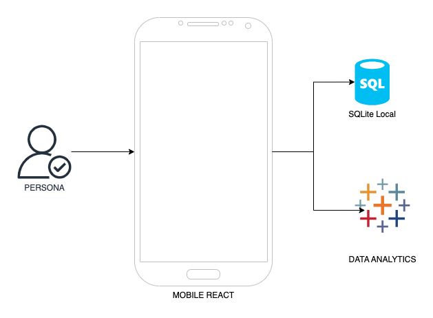
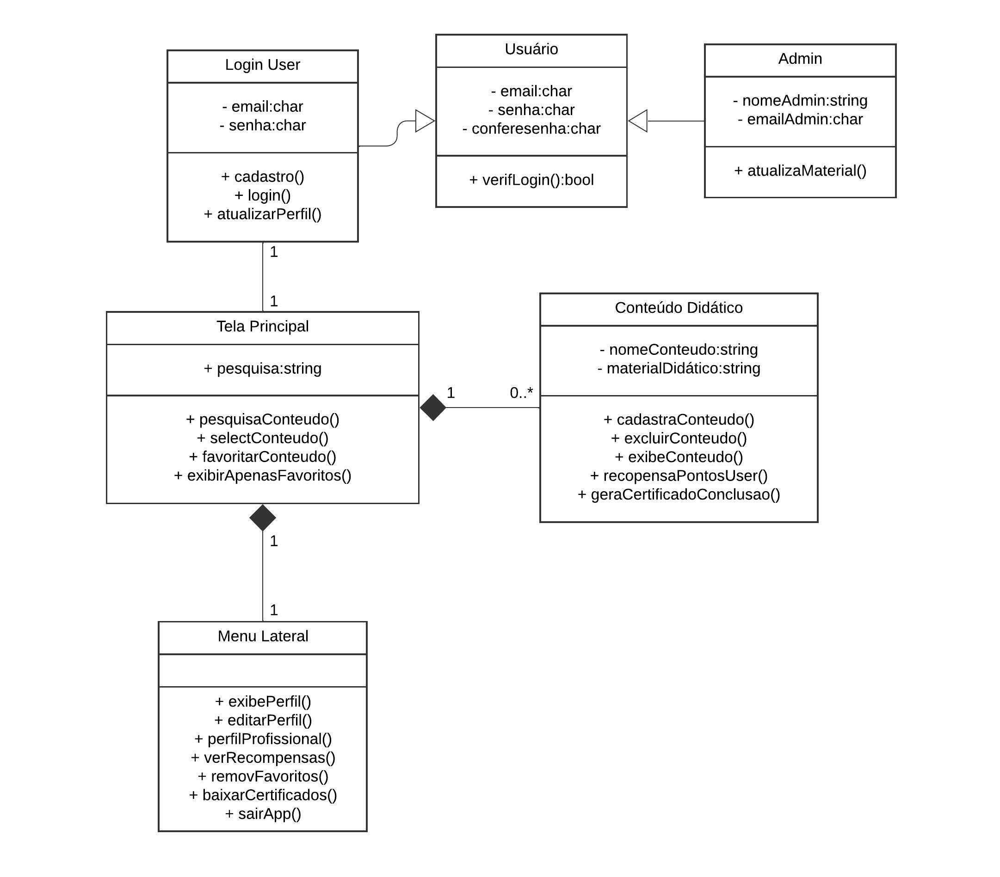

# Arquitetura da Solução

Pré-requisitos: <a href="https://github.com/ICEI-PUC-Minas-PMV-ADS/pmv-ads-2024-1-e3-proj-mov-t4-game-of-ti/blob/main/docs/03-Metodologia.md"> Projeto de Interface</a>

O software é estruturado em React nativo no mobile, tendo integração com os componentes de SQLite e DATA ANALYTICS CLOUD que fazem parte da solução e do ambiente de hospedagem da aplicação no device das persona.

## Diagrama de Classes

O diagrama de classes abaixo ilustra graficamente como será a estrutura do software proposto.

## Modelo ER

O modelo ER de classes abaixo ilustra graficamente como será a estrutura do software proposto.

## Esquema Relacional

O esquema relacional abaixo ilustra graficamente como será a estrutura do software proposto.

## Modelo Físico

O modelo físico do aplicativo móvel será estruturado em torno de várias telas e componentes interativos para proporcionar uma experiência de usuário intuitiva e eficiente. Abaixo está uma descrição das principais telas e funcionalidades do aplicativo:

Tela de Boas-Vindas:
   - Ao abrir o aplicativo pela primeira vez, os usuários serão recebidos com uma tela de boas-vindas. Esta tela fornecerá uma breve introdução ao propósito do aplicativo e incentivará os usuários a fazer login ou criar uma conta.

Autenticação de Usuário:
   - O aplicativo permitirá que os usuários façam login utilizando suas credenciais existentes ou se cadastrem para criar uma nova conta. Serão fornecidas opções de autenticação, como login com e-mail, login com redes sociais (por exemplo, Google, Facebook) ou autenticação biométrica (impressão digital, reconhecimento facial).

Dashboard Principal:
   - Após o login bem-sucedido, os usuários serão direcionados para o dashboard principal. Esta tela apresentará uma visão geral das principais funcionalidades do aplicativo, como acesso rápido a cursos, trilhas de aprendizado, estatísticas de progresso e recomendações personalizadas com base nos interesses do usuário.

Explorar Cursos e Trilhas de Aprendizado:
   - Os usuários poderão explorar uma variedade de cursos e trilhas de aprendizado disponíveis no aplicativo. Será possível visualizar detalhes sobre cada curso, incluindo descrição, instrutor, classificação e conteúdo do curso. Além disso, os usuários poderão se inscrever em cursos individuais ou seguir trilhas de aprendizado recomendadas para alcançar objetivos específicos de carreira.

Perfil do Usuário:
   - Os usuários terão acesso ao seu perfil pessoal, onde poderão visualizar seu progresso, conquistas, certificações obtidas e configurações da conta. Eles também poderão editar suas preferências de aprendizado, interesses e níveis de habilidade para receber recomendações mais relevantes.

Notificações e Atualizações:
   - O aplicativo enviará notificações push para informar os usuários sobre novos cursos disponíveis, atualizações de progresso, lembretes de prazos e outras informações importantes relacionadas ao aprendizado.

## Tecnologias Utilizadas

Plataforma Móvel:
   - O sistema será desenvolvido como um aplicativo móvel para Android, utilizando frameworks ou multiplataforma como React para garantir a compatibilidade e acessibilidade em diferentes dispositivos móveis.

Backend:
   - Se necessário, um backend simples poderá ser desenvolvido para suportar funcionalidades específicas do aplicativo, como autenticação de usuários, armazenamento de dados e processamento de lógica de negócios.
    
Frontend:
   - A interface do usuário será desenvolvida  para a plataforma Android utilizando um framework multiplataforma como React  para maximizar a eficiência e a consistência do design.
     - Serão seguidas as diretrizes de design específicas de cada plataforma para garantir uma experiência de usuário nativa e intuitiva.

Segurança:
   - Serão implementadas práticas de segurança para proteger os dados do usuário e garantir a integridade e confidencialidade das informações, utilizando recursos oferecidos pela plataforma móvel, como:
     - Armazenamento seguro de dados localmente no dispositivo utilizando APIs criptografadas.
     - Utilização de protocolos seguros de comunicação, como HTTPS, para proteger a transferência de dados entre o aplicativo e o servidor (se aplicável).

Integrações:
   - O aplicativo poderá integrar-se com serviços externos relevantes para fornecer funcionalidades adicionais e enriquecer a experiência do usuário, como:
     - Integrações com APIs de redes sociais para autenticação de usuários e compartilhamento de conteúdo.
     - Integrações com serviços de geolocalização para fornecer recursos baseados na localização do usuário, se aplicável.

Testes e Qualidade de Código:
   - Serão implementados testes para garantir a estabilidade e qualidade do código, incluindo testes unitários e de interface do usuário.
   - Serão seguidas práticas de desenvolvimento ágil para permitir entregas incrementais e iterativas do aplicativo, possibilitando ajustes conforme necessário durante o desenvolvimento.

## Hospedagem

A hospedagem e o lançamento da plataforma é feita nativa através de componestes disponibilizados pela fornecedora do sistema Android (Google).

## Qualidade de Software

### Dentre os atributos e subcaracterísticas da ISO/IEC 25010, foram escolhidos:

### Adequação funcional
Essa característica envolve a capacidade do software de realizar o que ele se propõe a fazer. As subcaracterísticas são:

Integridade funcional: cobertura de todas as tarefas e objetivos;  
Motivo: Visamos garantir total funcionamento da aplicação para gerar uma ótima experiência para os usuários.

### Eficiência de performance
Esse atributo está relacionado à performance do software relacionada à quantidade de recursos utilizados e possui as seguintes subdivisões:

Comportamento do tempo: tempo de resposta e processamento;  
Motivo: Ofertar um aplicativo rápido que satisfaça as expectativas do usuário. No mundo atual, buscamos sempre por coisas mais ágeis que facilite a nossa vida e por vezes trocamos algo ultrapassado por um novo e mais rápido por causa da correria do dia a dia afim de economizar tempo. Um sistema lento causaria desinteresse em nossos usuários.

Uso de recursos: quantidade e tipos de recursos utilizados por um produto ou sistema;  
Motivo: Oferecer ao usuário ferramentas para facilitar a utilização do aplicativo.

Capacidade: limite máximo de um produto.  
Motivo: Ter capacide de receber implementações e atualizações do administrador a qualquer momento sem que exceda a capacidade.

### Compatibilidade
É a capacidade de um produto, sistema ou componente de trocar informações, assim como de realizar funções enquanto compartilha um hardware. São subcaracterísticas:

Coexistência: capacidade de realizar funções eficientemente enquanto compartilha um ambiente ou recursos com outros produtos;  
Motivo: Garantir a eficiência da aplicação.

### Usabilidade
Trata-se da capacidade de um produto ou sistema de realizar objetivos eficientemente, efetivamente e de maneira satisfatória. As subcaracterísticas são as seguintes:

Adequação reconhecível: capacidade de reconhecer se um produto ou sistema é apropriado para suas necessidades;  
Motivo: Temos foco em pessoas interessadas por TI e ofereceremos à elas conteudos temáticos que abrangem várias áreas correlatas e com a possibilidade de pesquisar e favoritar os temas escolhidos.

Capacidade de aprendizado: facilidade de aprender como utilizar o produto ou sistema;  
Motivo: Desejamos elaborar uma aplicação de fácil utilização e que conte com ferramentas para alcançar tal objetivo.

Estética da interface de usuário: agradabilidade da interface;  
Motivo: Desejamos criar um ambiente agradável que trasmita calmaria, sem multas confusões visuais ou agitações, uma vez que nossa aplicação ofertará conteúdos didáticos para fins de aprendizado.

### Confiabilidade
Diz respeito a quão bem um produto realiza funções específicas sob condições específicas. Estas são as subcaracterísticas deste atributo da ISO/IEC 25010:

Maturidade: capacidade do produto atingir as necessidades de confiabilidade;  
Motivo: Queremos transmitir segurança e confiabilidade para nossos usuários.
Disponibilidade: se um sistema, produto ou componente está acessível e operante;  
Motivo: Queremos garantir que a aplicação esteja operante e  todas as suas funcionalidades.

### Segurança
A capacidade de um produto ou sistema proteger informação e dados de vulnerabilidades é chamada de segurança, dentre as características da ISO/IEC 25010. As subdivisões são:

Confidencialidade – produto ou sistema é capaz de garantir que dados são acessados apenas por aqueles que têm acesso autorizado.  
Motivo: Almejamos integrar junto a aplicação o cadastro de perfil profissional que pode conter dados pessoais, por isso é preciso total segurança a estes dados se tal funcionalidade for implementada no sistema.

Integridade – capacidade de prevenir acesso não-autorizado e modificação de dados ou programas de computador.  
Motivo: Desejamos uma aplicação segura que seja acessada por login e senha e que posteriormente o usuário possa acessar suas fotos para editar seu perfil, mas sem comprometer a segurança da aplicação.

Autenticidade – a identidade de um sujeito ou recurso pode ser provada.  
Motivo: Queremos emitir certificados que comprovem que nosso usuário completou os estudos a um devido tema sempre após concluir 100% do conteúdo.

### Manutenibilidade
A manutenibilidade é a característica que engloba a capacidade de um produto ou sistema ser modificado, atualizado e adaptado às mudanças de ambiente e requerimentos. Abaixo, vamos ver as subcaracterísticas deste atributo.

Modularidade: programas ou sistemas podem sofrer mudanças sem impactar em outros componentes;
Reusabilidade: capacidade de um recurso poder ser utilizado em mais de um sistema;
Modificabilidade: capacidade de um produto ou sistema ser modificado sem introduzir defeitos ou diminuir a qualidade atual;  
Motivo: Nossa aplicação deverá contar com atualizações dos materiais didáticos e implementação de novos conteúdos, o que torna necessário a manutenibilidade.

### Portabilidade
Esta característica é a capacidade de um sistema, produto ou componente de ser transferido de um ambiente para outro. As suas subcaracterísticas são:

Adaptabilidade: capacidade de um produto ou sistema de ser adaptado a um novo hardware, software ou outros ambientes;  
Motivo: É interessante que o aplicativo seja compatível a versões diferentes de Android e possivelmente adaptável para IOS.
